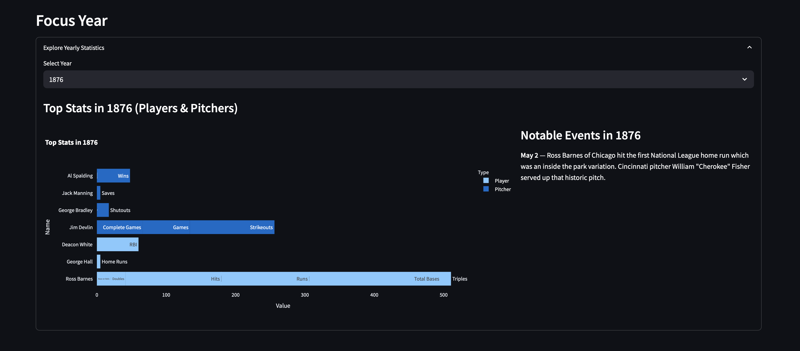
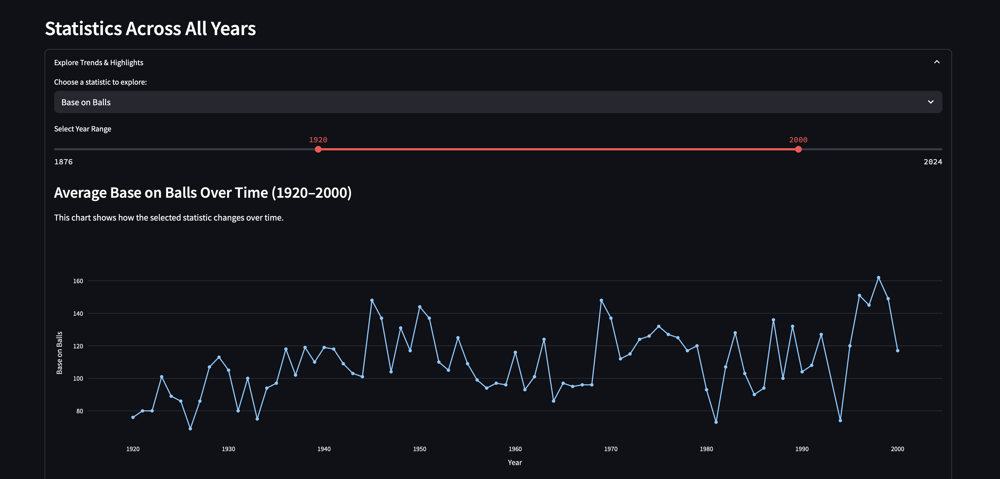
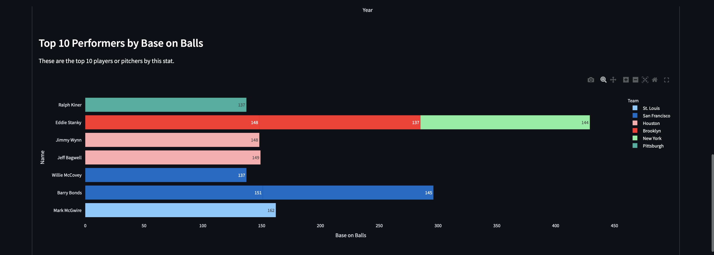
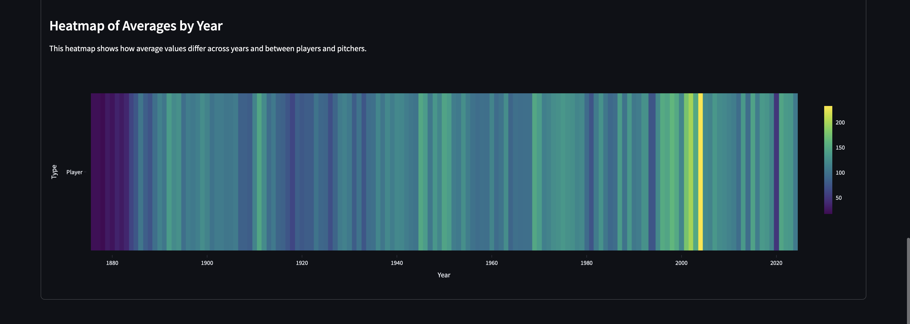
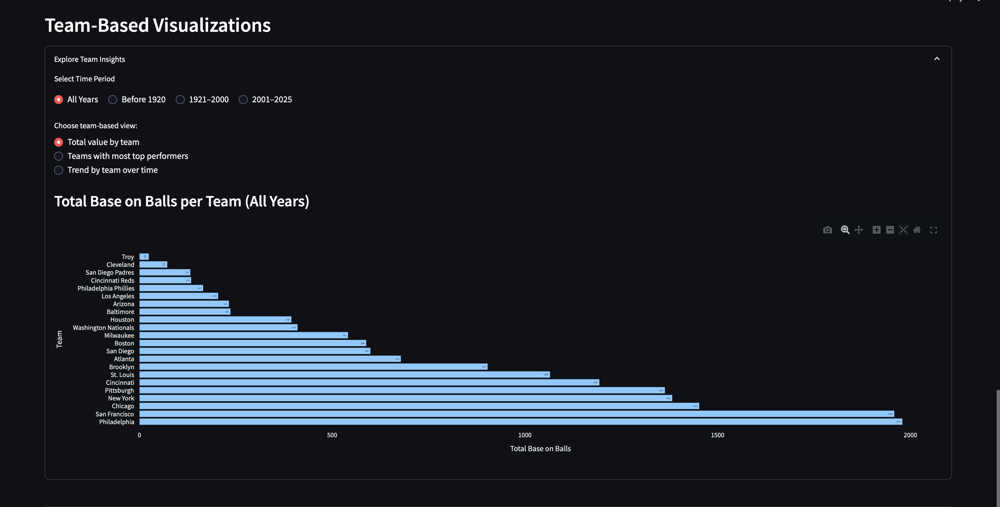
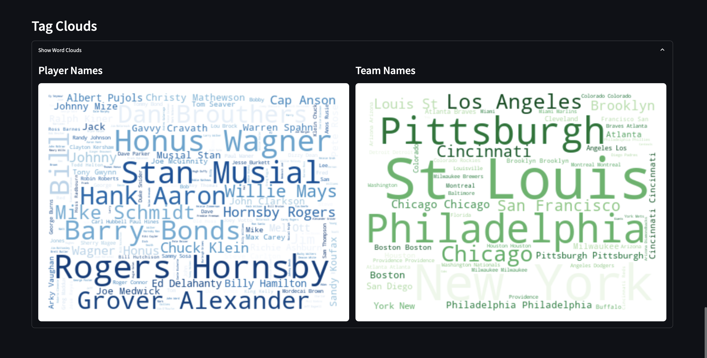

# Baseball Analytics Dashboard

This project is a full data pipeline and interactive dashboard exploring historical baseball statistics and events.

It includes:

- Web scraping of player, pitcher, and event data from Baseball Almanac
- Cleaning and transformation of scraped data using Python and Pandas
- Storage into a SQLite database
- Interactive visualizations with Streamlit and Plotly

## Setup

1. Clone the repository:
git clone https://github.com/AidaBur/capstone-baseball.git

2. Navigate into the folder:
cd dashboard

3. Create and activate a virtual environment (optional but recommended):
python -m venv venv
source venv/bin/activate

4. Install dependencies:
pip install -r requirements.txt

5. streamlit run app.py

## Features

- Scrapes players, pitchers, and events from Baseball Almanac
- Cleans and processes the data using Pandas
- Stores structured data in SQLite database
- Interactive dashboard with multiple visualizations:
    - Focus Year stats & events
    - Trend analysis across decades
    - Team-based performance comparisons
    - Word clouds for players and teams
- User controls: dropdowns, sliders, radio buttons, expanders

## Screenshots

### Focus Year Stats

### Trends Across All Years

### Team-Based Visualizations

### Word Clouds

## Dependencies

- Python 3.10+
- pandas
- selenium
- beautifulsoup4
- requests
- plotly
- streamlit
- wordcloud
- matplotlib
- sqlite3
- webdriver-manager

## How It Works

1. **Scraping:**  
   `scraping/` scripts use Selenium and BeautifulSoup to collect data from historical baseball pages.

2. **Cleaning:**  
   Scripts in `utils/` clean, format, and transform CSVs to prepare them for analysis.

3. **Database:**  
   SQLite database is created with tables for players, pitchers, and events.

4. **Dashboard:**  
   Streamlit app in `dashboard/app.py` uses Plotly to visualize cleaned data, including:
   - Interactive charts and sliders
   - Dropdown-based filtering
   - Word clouds of names and teams

This project is for educational purposes only. All data is sourced from [Baseball Almanac](https://www.baseball-almanac.com).